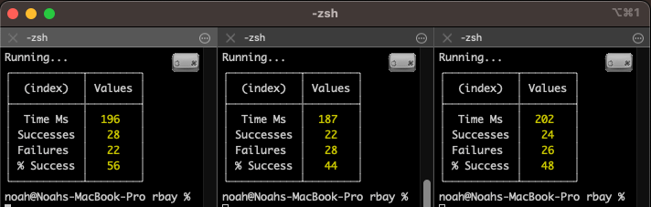

# Redis: The Complete Developer's Guide

Redis: The Complete Developer's Guide by Stephen Grider

## File structure

- RedisInsight
  - `yarn --cwd redisinsight/api/ start:dev`
  - `yarn start:web`
  - `open -a "Google Chrome.app" http://127.0.0.1:8080/ http://localhost:5050/api/docs`
- e-commerce-app
  - redis stack server
    - `docker compose up`
    - `docker exec -it redis-stack-server redis-cli`
  - rbay
    - `npm install`
    - `npm run dev` -> localhost:3000
    - 03-e-commerce-app-first
      - `e-commerce-app/src/services/queries/page-cache.ts`
    - 06-redis-has-gotchas
      - playground: `e-commerce-app/sandbox/index.ts`
    - 07-design-patterns
      - `e-commerce-app/src/services/queries`
    - 08-pipeline
      - playground: `e-commerce-app/sandbox/index.ts`
    - 10-sets
      - `e-commerce-app/src/services/queries/likes`
    - 12-sorted-sets
      - `e-commerce-app/src/services/queries/users`
      - `e-commerce-app/src/services/queries/items`
    - 13-relational-data
      - `e-commerce-app/src/services/queries/items`

# Details

<details open> 
  <summary>Click to Contract/Expend</summary>

## RedisInsight

RedisInsight is a visual tool that provides capabilities to design, develop and optimize your Redis application.

- [RedisInsight Github](https://github.com/RedisInsight/RedisInsight)
- TypeScript, Electron, SASS, Nest, testcafe

### Why using RedisInsight

> I would like to use it for throughout this course as this project is a great opensource \
> that I could learn so many things such as
>
> - Electron
> - API with nest server
> - e2e testing with testingcafe
> - as well as redis interface and commends and so on.

- fork RedisInsight to my github
- `git clone git@github.com:pcsmomo/RedisInsight.git`

### Install and build

[RedisInsight - Wiki](https://github.com/RedisInsight/RedisInsight/wiki/How-to-build-and-contribute)

- install dependencies and run it

```sh
yarn install
# ValueError: invalid mode: 'rU' while trying to load binding.gyp
# https://github.com/nodejs/node-gyp/issues/2219
```

#### check the python and node version

- Python: v3.10
- Node: v16

```sh
# change the python version from 3.11 to 3.10
pyenv versions
#   system
#   3.9.15
#   3.10.7
# * 3.11.3 (set by /Users/noah/.pyenv/version)
pyenv local 3.10.7
python --version
# Python 3.10.7
```

```sh
nvm list
#         v16.15.0
# ->     v18.1.0
nvm use lts/gallium
node --version
# v16.15.0
```

#### Install dependencies

```sh
yarn install
yarn --cwd redisinsight/api/
```

#### Change the default port for API

5000 -> 5050

because for mac, the port 5000 is occufied, https://developer.apple.com/forums/thread/682332

- `RedisInsight/configs/webpack.config.web.prod.babel.js`
- `RedisInsight/redisinsight/api/config/default.ts`

#### Run for web

```sh
# run api server
yarn --cwd redisinsight/api/ start:dev

# run web server
yarn start:web
```

- http://localhost:5050/api/docs
  - Swagger API Documentation
- http://127.0.0.1:8080/
  - Web interface

#### Run Electron desktop app

```sh
# build the desktop app
yarn build:statics

# run api server
yarn --cwd redisinsight/api/ start:dev

# run the desktop app
yarn start:main # hmm doesn't work at the moment

# yarn start # on the version, b04c050b942e7ff17257e1027a0607cefe99fb3a, on March, 2023, works for me.
```

- connect to 127.0.0.1:6379 to see the list of keys on my local redis

## Section 1: Get Started Here!

### 4. Why Use Redis?

Redis is fast

- All data is stored in memory
- Data is organized in simple data structures
- Redis has a simple feature set

### 5. Initial Setup

- [Redis Cloud](https://app.redislabs.com/)
- [rbook - Redis Javascript Notebook](http://rbook.cloud/)
- [npm rbook - npx rbook](https://www.npmjs.com/package/rbook)
  - it doesn't look like the latest version

## Section 2: Commands for Adding and Querying Data

### 8. Basic Commands

#### list of the data type

[Redis Documentation - Data Types](https://redis.io/docs/data-types/)

- String: Store plain string or number
- List: List of strings
- Hash: Collection of key-value pairs
- Set: Set of strings (each string is unique)
- Sorted Set: Set of strings in a particular order
- Bitmap: Kind of like a collection of booleans
- Hyperloglog: Kind of like a collection of booleans
- JSON: Nested JSON structure
- Index: Internal data used for searching

### 9. Documentation on Commands

[⭐️ Redis Commands Documentation](https://redis.io/commands)

# Documentations

## Commands and practice

- [Section 2: Basic commands](./docs/README-02-basic.md)
- [Section 5: Hash](./docs/README-05-bash.md)
- [Section 9: Set](./docs/README-09-set.md)
- [Section 11: Sorted Set](./docs/README-11-sorted-set.md)
- [Section 13: Sort](./docs/README-13-sort.md)
- [Section 14: HyperLogLog](./docs/README-14-hyperloglog.md)
- [Section 15: List](./docs/README-15-list.md)
- [Section 16: Transaction](./docs/README-16-transaction.md)
- [Section 17: Lua && Lua Script with Redis](./docs/README-17-lua.md)
- [Section 19: Querying Data with RediSearch](./docs/README-19-redis-search.md)

## Section 3: E-Commerce App Setup

### 24. Don't Skip This Video

1. Node JS Setup
2. extract the 'rbay.zip'
3. npm install
4. add connection info into `.env`
5. npm run dev

```sh
npm install
npm run dev -- --open
```

### 25. Redis Client Libraries

- [node-redis](https://github.com/redis/node-redis)
- [ioredis](https://github.com/luin/ioredis)
  - not sure it'd be used in this course?

### 27. Redis Design Methodology

- What type of data are we storing
  - Strings
- Should we be concerned about the size of data?
  - YES! Only cache certain pages
- Do we need to expire this data?
  - Yes, expire after some number of minutes/hours/days
- What will be the key naming policy be for this data?
- Any business-logic concerns?
  - Nope

### 28. Key Naming Methodology

- Common practice, `:`
  - users:45
  - items:19
  - user:posts:901
  - posts:jqip25jnm
- Small twist on common practice, `#`
  - users#45
  - items#19
  - user#posts#901
  - posts#jqip25jnm

## Section 4: Local Redis Setup

### 31. Installing on MacOS

#### Redis Stack

In addition to all of the features of Redis OSS, Redis Stack supports:

- Probabilistic data structures
- Queryable JSON documents
- Querying across hashes and JSON documents
- Time series data support (ingestion & querying), including full-text search
- Graph data models with the Cypher query language

#### Links

- [Redis Stack - About](https://redis.io/docs/stack/about/)
- [Redis Stack Server on Docker](https://redis.io/docs/stack/get-started/install/docker/)
- [Redis Stack Server - docker hub](https://hub.docker.com/r/redis/redis-stack-server)

## Section 5: Hash Data Structures

### 33. Hashes in Redis

Hash doesn't accept nested object

## Section 6: Redis Has Gotcha's!

### 38. Slightly Unpredictable HSET and HGETALL

```sh
npm run sandbox
```

### 39. Issues with HSET

node-redis tries to make all values to plain string with `toString()`

However, `null` doesn't have `toString()`

### 40. Issues with HGETALL

if the key doesn't exist, it will return `{}`, not `null`

## Section 7: Powerful Design Patterns

### 43. What Data Type for Each Resource

#### Reasons to store as Hash

`users`, `sessions`, `items`

- The record has manu attributes
- A collection of these records have to be sorted many different ways
- Often need to access a single record at a time

#### Don't use Hashes When..

`bids`, `views`, `likes`

- The record is only for counting or enforcing uniqueness
- Record stores only one or two attributes
- Used only for creating relations between different records
- The record is only used for time series data

### 51. Serializing Date Times

#### Date Time Formats

- Date()
- Unix time (Epoch Unix Timestamp). Seconds, since Jan 1 1970
  - 1683757575
- Unix time as milliseconds
  - 1683757575000

```js
// to unix time as milliseconds
createdAt: attrs.createdAt.toMillis(),
```

## Section 8: Pipelining Commands

### 55. Running Multiple Commands at the Same Time

```sh
redis-cli
FLUSHALL # or delete all keys
FLUSHDB # the same
```

## Section 14: HyperLogLog Structures

### 98. HyperLogsLogs

- Algorithm for approximately counting the number of unique elements
- Similar to a set, but doesn't store the elements
- Will seem useless at first glance

### 99. When to use HyperLogsLogs

> If using `SET`, it will take lots of storage as it should use `id`s in it.\
> but with `HyperLogLog`, it would only take limited space, 12kb no matter how many elements are added

The downside is that PFCOUNT give us an approximate count,\
so if we add 1000 views, `PFCOUNT views` could give us with 0.81% error, so 991 to 1008

So if the result should be accurate, HyperLogLog is not a good option\
but if the error coverage is fine, we can use it.

## Section 15: Storing Collections with Lists

### 101. Lists

- Sort an ordered list of strings
- Not an array! Not an array! Not an array!
- Implemented as a doubly-linked list
- Often used for time-series data
- You should probably use this less often than you think

### 106. List Use Cases

- Append-only or prepend-only data
  - E.g: temperature readings, stock values
- When you only need the last/first N values of something
- Your data has no sort order besides the order it was inserted

#### Don't use lists if you have many items AND...

- You need to apply some filtering criteria
- Your data is sorted by some attribute

### 108. Serializing and Deserializing Bids

[npm luxon - dates and times](https://www.npmjs.com/package/luxon)

### 113. Issues with Bids - Concurrency issue

- Create a new Item
- type bid price, 10
- Open Browser inspection
- Choose the "Place Bid" button
- execute the script below on the console
  ```js
  // $0 means the selected element
  for (let i = 0; i < 15; i++) {
  	$0.click();
  }
  ```

### 114. Understanding Concurrency Issues

- Use atomic update command
  - like `HINCRBY`, `HSETNX`
- Use a transaction with the `WATCH` command
- Use a lock
- Use a custom `LUA` update script

### 116. Transactions

- Groups together one or more commands to run sequentially
- Similar to pipelining, but some big differences!
- Transactions cannot be undone/rolledback/reversed! (Unlike other databases)
  - `MULTI SET color red SET count 5 EXEC`

### 119. Solving Multiple Bids with a Transaction

Test the concurrency issue as the same as "113. Issues with Bids"

## Section 17: Extending Redis with Scripting

### 122. Lua Scripting

[Lua Language](https://www.lua.org/)

### 123. Basics of Lua

- [Lua Online Playground](https://www.tutorialspoint.com/execute_lua_online.php)

## 126. Loading and Executing Scripts

#### SCRIPT

- don't forget `return`
- if there are '' in your script, use ""

```sh
SCRIPT LOAD 'return 1 + 1'
# "c301e0c5bc3538d2bad3fdbf2e281887e643ada4"
```

#### EVALSHA

- don't forget `0` at the last

```sh
# don't forget 0
EVALSHA c301e0c5bc3538d2bad3fdbf2e281887e643ada4 0
# (integer) 2
```

### 127. Providing Arguments

- `return 1 + ARGV[1]`
  - `ARGV` is a global variable
  - `ARGV = {'1', '2', '3', '4'}`
- `EVALSHA <ID> 0 '1' '2' '3' '4'`
  - we must provide it as string type

### 128. Providing Key lists

- `return redis.call('GET', 'color')`
- `return redis.call('GET', KEYS[1])`
  - `KEYS` is a global variable
- `EVALSHA <ID> 1 color`
  - `1` is a count of keys we are about to list
- `EVALSHA <ID> 2 color items`
- `EVALSHA <ID> 2 color items '4' '6'`
  - 2 KEYS, 2 ARGV

### 129. When to Use Scripts

- Limiting the amount of data exchanged between server + redis
- Solving some concurrency issues (more on this later)
- Minimizing the number of round trips between server + . redis
- ???

#### Script down sides

- Keys must be known ahead of time
- Tough to test sdcripts
- Loss of language features (E.G type checking with Typescript)
- Another language to deal with (Lua)

### 135. Issues with WATCH

Concurrency test with sandbox

1. Temporary comment out the validation in `bids.ts` to allow any prices
   ```js
   // if (item.price >= attrs.amount) {
   //	 throw new Error('Bid too low');
   // }
   ```
2. Run 3 `rbay` apps in different ports 3000, 3001 and 3001
   - `npm run dev -- --port 3001`
3. Fill up the script in the `sandbox` folder.
   - [135-concurrency.ts](./e-commerce-app/rbay/sandbox/135-concurrency.ts)
   - `auth` cookie
     - Create a user in the app
     - copy the `auth` cookie in "application" from the browser
     - paste it to the code
   - `itemId`
     - Create an item in the app and copy/paste the `itemId`
4. open 3 terminal tabs, <!-- (each sandbox will use different `itemId`s) -->
   <!-- - Create an item in the app and copy/paste the `itemId` -->
   - Cmd + Shift + i in Term2, then I can run scripts in multi tabs at the same time
   - `npm run sandbox`



### 137. Understanding the Goal

- Our concurrency system will implement a simplified version of the `Redlock` algorithm
  - [Redlock - glossary](https://redis.com/glossary/redlock/)
  - [Redlock - implementations ](https://redis.io/docs/manual/patterns/distributed-locks/)
- On any serioous project, use Relock instead of what we're building here

### 140. It Works!


> But it is 10 times slower (2000ms) because it retries during locks.

I've changed `retryDelayMs` from 100ms to 10ms in [lock.ts](./e-commerce-app/rbay/src/services/redis/lock.ts). It's a lot faster!


### 142. Another Lock Issue - delete lockKey from other transaction

### 145. One Last Issue - process takes too long (timeout)

### 146. Providing Expiration Signals

```js
if (signal.expired) {
	throw new Error("Lock expired, can't write anymore data");
}
```

It seems to be working, but not 100% guaranteed.\
Let's go with an advanced solution in the next lecture.

### 147. Alternate Expiration Solution

[Proxy - MDN](https://developer.mozilla.org/en-US/docs/Web/JavaScript/Reference/Global_Objects/Proxy)

## Section 19: Querying Data with RediSearch

### 149. Redis Core vs Redis Stack

- Without Redis Stack, you will have to manually set up modules to Redis Core

#### Redis Stack

- RedisSearch
- RedisJSON
- RedisGraph
- RedisTimeSeries
- RedisBloom

### 150. Using Modules in Production

- Option #1
  - AWS/GC runs Redis for you.
  - Can't use modules here as they uses basic redis core.
  - So you should know how to use basic redis core
- Option #2
  - Run Redis yourself on a cloud provider
  - with VM or Docker
- Option #3
  - Redis Labs Manager
  - Redis Labs runs a copy of Redis for you on AWS/GC/Azure with a few modules preinstalled

### 151. Overview on Search

1. Create an index (Only once): `FT.CREATE`
   - Find all the keys that start with `items#`
   - Out of those, record some info about the fields `name`, `color`, and `price`
2. Run a query: `FT.SEARCH`
   - Using the index, find items with a particular name, color, price

### 152. Creating and Using an Index

- `FT.CREATE`: Creates an index with the given spec
- `FT.SEARCH`: Searches the index with a textual query, returning either documents or just ids
  - `()`: for TEXT
  - `{}`: for TAG
  - `[]`: for NUMERIC

### 153. Details on Indexes

- `FT.DROPINDEX`: Deletes the index

- Querying
  - Gives the **EXACT** result you ask for
  - Examples
    - Get all card made in 1955 with a color of red
    - Get all cars made before 1960 with a name of 'fast car'
    - Get all cars with a color of blue
- Searching
  - Gives results that **BEST ANSWER** your question
  - Examples
    - Get all cars with a name like 'car that goes fast'
    - Get all cars related to '90 blue fast'
    - Get all cars related to 'gast var'

</details>
