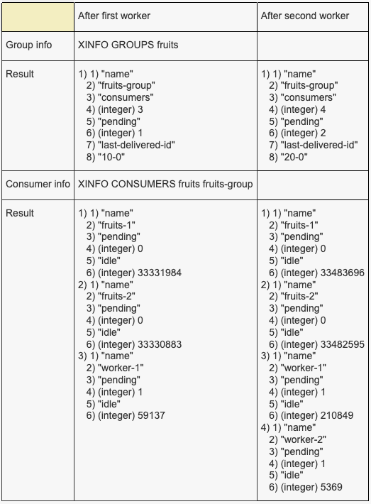

# Section 21: Service Communication with Streams

[Redis Commands: Streams](https://redis.io/commands/?group=stream)

## 177. Adding Messages to a Stream

- `XADD`: Appends a new message to a stream. Creates the key if it doesn't exist.

```sh
XADD fruits * name strawberry color red
# "1684573584965-0"

# fruits: where the stream is stored
# *: Have Redis generate an ID for us (a unix timestamp)
# name: key
# strawberry: valule
# color: key
# red: value
```

## 178. Consuming Streams with XREAD

- `XREAD`: Returns messages from multiple streams with IDs greater than the ones requested. Blocks until a message is available otherwise.
  - timestamp is _EXCLUSIVE_

```sh
# Read all messages from the beginning of time
XREAD STREAMS fruits 0-0
# 1) 1) "fruits"
#    2) 1) 1) "1684573584965-0"
#          2) 1) "name"
#             2) "strawberry"
#             3) "color"
#             4) "red"

# Read all messages after (but not including) this timestamp
XREAD STREAMS fruits 1684573584965-0
# (nil)
XREAD STREAMS fruits 1684573584964-0
# 1) 1) "fruits"
#    2) 1) 1) "1684573584965-0"
```

```sh
XADD fruits * name banana color yellow
# "1684574013812-0"

XREAD STREAMS fruits 0-0
# 1) 1) "fruits"
#    2) 1) 1) "1684573584965-0"
#       2) 1) "1684574013812-0"

XREAD COUNT 1 STREAMS fruits 0-0
# 1) 1) "fruits"
#    2) 1) 1) "1684573584965-0"

XREAD COUNT 3 STREAMS fruits 0-0
# 1) 1) "fruits"
#    2) 1) 1) "1684573584965-0"
#       2) 1) "1684574013812-0"
```

## 179. Blocking Reads

```sh
# if no messages are available, wait for 3000 ms before returning
XREAD BLOCK 3000 STREAMS fruits 0-0
# the new message below will be displayed here
```

```sh
# during waiting, add a new message in a different terminal
XADD fruits * name orange color orange
# "1684621171617-0"
```

```sh
# either COUNT or BLOCK command will be ignored depending on data existance
XREAD COUNT 5 BLOCK 3000 STREAMS fruits 1684621171617-0
XREAD COUNT 5 BLOCK 3000 STREAMS fruits 0-0
XADD fruits * name apple color red
```

## 180. An XREAD Shortcut

```sh
# $: Look for messages starting at the 'current' time
XREAD COUNT 5 BLOCK 3000 STREAMS fruits $
XADD fruits * name pineapple color yellow
# "1684621806402-0"
```

## 182. Reading Streams with XRANGE

- `XRANGE`: Returns the messages from a stream within a range of IDs.
  - timestamp is _INCLUSIVE_

```sh
# inclusive
XRANGE fruits 1684621171617-0 1684621806402-0
# 1) 1) "1684621171617-0"
#    2) 1) "name"
#       2) "orange"
#       3) "color"
#       4) "orange"
# 2) 1) "1684621355920-0"
#    2) 1) "name"
#       2) "apple"
#       3) "color"
#       4) "red"
# 3) 1) "1684621806402-0"
#    2) 1) "name"
#       2) "pineapple"
#       3) "color"
#       4) "yellow"

# exclusive
XRANGE fruits (1684621171617-0 (1684621806402-0
# 1) 1) "1684621355920-0"
#    2) 1) "name"
#       2) "apple"
#       3) "color"
#       4) "red"

# all messages
XRANGE fruits - +

# after 1684621171617-0 to the latest
XRANGE fruits (1684621171617-0 +
# 1) 1) "1684621355920-0"
#    2) 1) "name"
#       2) "apple"
#       3) "color"
#       4) "red"
# 2) 1) "1684621806402-0"
#    2) 1) "name"
#       2) "pineapple"
#       3) "color"
#       4) "yellow"
```

## 185. Creating and Inspecting Consumer Groups

- `XGROUP CREATE`: Creates a consumer group.
- `XGROUP CREATECONSUMER`: Creates a consumer in a consumer group.
- `XINFO GROUPS`: Returns a list of the consumer groups of a stream.
- `XINFO CONSUMERS`: Returns a list of the consumers in a consumer group.

```sh
DEL fruits

XGROUP CREATE fruits fruits-group $ MKSTREAM
# fruits: Key of the stream
# fruit-gruop: Name of the group
# $: (or 0-0)if the stream already exists, only handle messages added from this point on
# MKSTREAM: Make the stream, if it does not already exist

XGROUP CREATECONSUMER fruits fruits-group fruits-1
# fruits: Key of the stream
# fruit-gruop: Name of the group
# fruits-1: Name of the new consumer
XGROUP CREATECONSUMER fruits fruits-group fruits-2
```

```sh
XINFO GROUPS fruits
# 1) 1) "name"
#    2) "fruits-group"
#    3) "consumers"
#    4) (integer) 2
#    5) "pending"
#    6) (integer) 0
#    7) "last-delivered-id"
#    8) "0-0"

XINFO CONSUMERS fruits fruits-group
# 1) 1) "name"
#    2) "fruits-1"
#    3) "pending"
#    4) (integer) 0
#    5) "idle"
#    6) (integer) 196811
# 2) 1) "name"
#    2) "fruits-2"
#    3) "pending"
#    4) (integer) 0
#    5) "idle"
#    6) (integer) 195710
```

## 186. Consumer Groups in Action

- `XREADGROUP`: Returns new or historical messages from a stream for a consumer in a group. Blocks until a message is available otherwise.

```sh
# hardcoded ID: (For test, we leave Redis auto-generate the ID in general)
XADD fruits 10-0 name banana color yellow
XADD fruits 20-0 name apple color red
XADD fruits 30-0 name orange color orange
# "30-0"
```

### consume with worker 1

```sh
XREADGROUP GROUP fruits-group worker-1 COUNT 1 BLOCK 2000 STREAMS fruits >
# GROUP fruits-group: Name of the group
# worker-1: Name of the worker we are reading as
# COUNT 1: Optional, read at most 1 entry
# BLOCK 2000: Optional, block for 2000ms
# STREAMS fruits >: Only messages that were not delivered to any other consumer in this groupo
# (STREAMS fruits 0-0: All messages)

# 1) 1) "fruits"
#    2) 1) 1) "10-0"
#          2) 1) "name"
#             2) "banana"
#             3) "color"
#             4) "yellow"
```

```sh
XINFO GROUPS fruits
# 1) 1) "name"
#    2) "fruits-group"
#    3) "consumers"
#    4) (integer) 3
#    5) "pending"   # not acqknowledge yet
#    6) (integer) 1
#    7) "last-delivered-id"
#    8) "10-0"
XINFO CONSUMERS fruits fruits-group
# 1) 1) "name"
#    2) "fruits-1"
#    3) "pending"
#    4) (integer) 0
#    5) "idle"
#    6) (integer) 33331984
# 2) 1) "name"
#    2) "fruits-2"
#    3) "pending"
#    4) (integer) 0
#    5) "idle"
#    6) (integer) 33330883
# 3) 1) "name"
#    2) "worker-1"
#    3) "pending"
#    4) (integer) 1
#    5) "idle"
#    6) (integer) 59137
```

### consume with worker 2

```sh
XREADGROUP GROUP fruits-group worker-2 COUNT 1 BLOCK 2000 STREAMS fruits >
# 1) 1) "fruits"
#    2) 1) 1) "20-0"
#          2) 1) "name"
#             2) "apple"
#             3) "color"
#             4) "red"
```

```sh
XINFO GROUPS fruits
# 1) 1) "name"
#    2) "fruits-group"
#    3) "consumers"
#    4) (integer) 4
#    5) "pending"
#    6) (integer) 2
#    7) "last-delivered-id"
#    8) "20-0"
XINFO CONSUMERS fruits fruits-group
# 1) 1) "name"
#    2) "fruits-1"
#    3) "pending"
#    4) (integer) 0
#    5) "idle"
#    6) (integer) 33483696
# 2) 1) "name"
#    2) "fruits-2"
#    3) "pending"
#    4) (integer) 0
#    5) "idle"
#    6) (integer) 33482595
# 3) 1) "name"
#    2) "worker-1"
#    3) "pending"
#    4) (integer) 1
#    5) "idle"
#    6) (integer) 210849
# 4) 1) "name"
#    2) "worker-2"
#    3) "pending"
#    4) (integer) 1
#    5) "idle"
#    6) (integer) 5369
```


